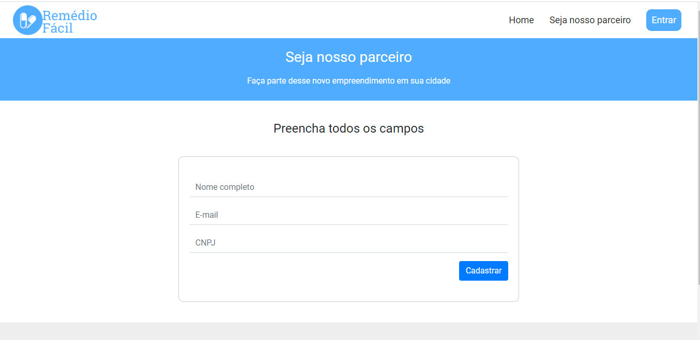
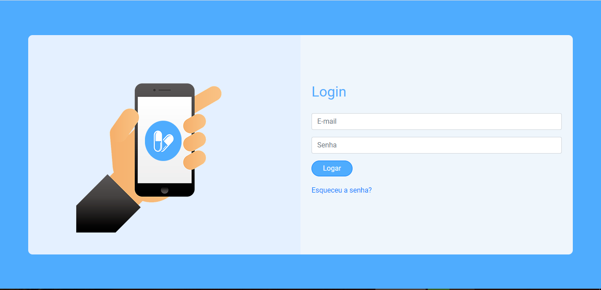
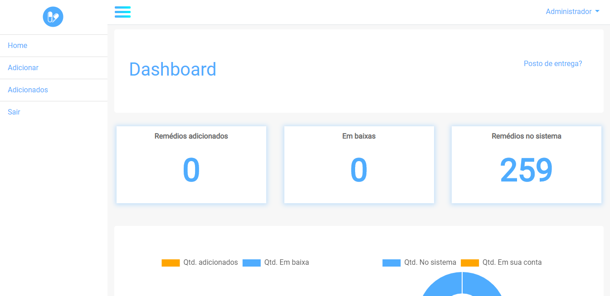

Remédio Fácil

Um projeto reestruturado do meu tcc, que tem a finalidade de ajudar pessoas que buscam medicamentos a encontrarem nas farmácias de sua região.

Este projeto refere-se a parte web, onde é gerenciada toda a parte de cadastro e verificação de farmácias (parcerias). Cada cadastro necessita de confirmação, e tal confirmação é enviada por e-mail, para o novo cadastro. Após isso o administrador do sistema, acessa a página de gerenciamento, lá confere enviando o cnpj do novo cadastro para um webservice que nos retornará seus dados, caso seja verdadeiro. Após isso, poderemos adicionar tal cadastro e lhe enviar os dados de acesso por e-mail ou excluí-lo.

Todos as novas adições realizadas pelo novo cadastro, após acessar sua nova conta, será adicionadas em tabelas do banco de dados, que serão utilizadas para a comunicação da parte web com a parte mobile através do webservice.

Nesse projeto contém três pastas, pois referem-se a sub domínios do projeto principal.

Foram utilizadas:

- PHP;
- Estrutura MVC;
- Sistemas de rotas;
- Bootstrap;
- Jquery;
- Webservice;
- Composer
- PhpMailer

Algumas telas do sistema

Tela de início

Tela de cadastros de parcerias

Tela de login

Tela de gerenciamento

